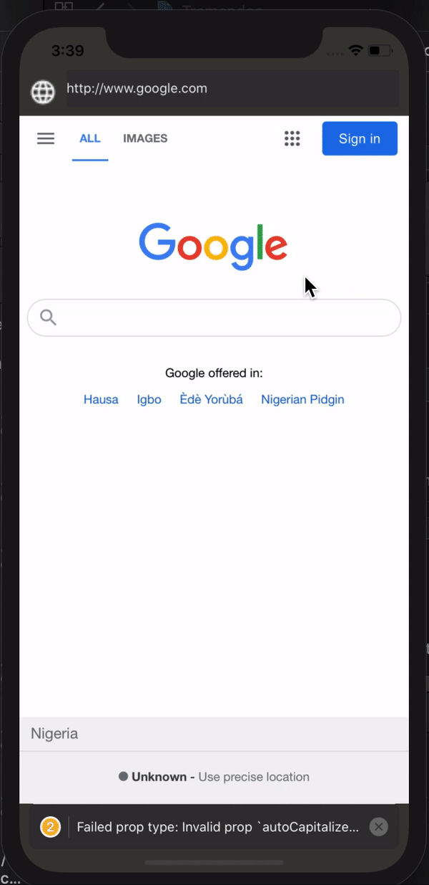

# Introduction

This is the repository for `AdaptButton`.

---

## Usage Instructions

### Installation

1. Run `npm install`
1. Go to ios folder from project root Run `pod install `
### Usage

- Auto Refresh

